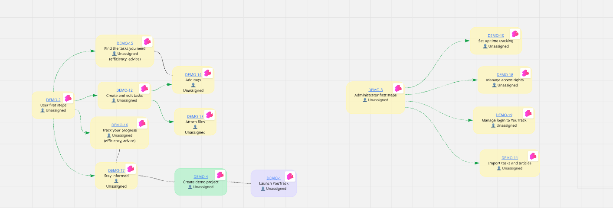
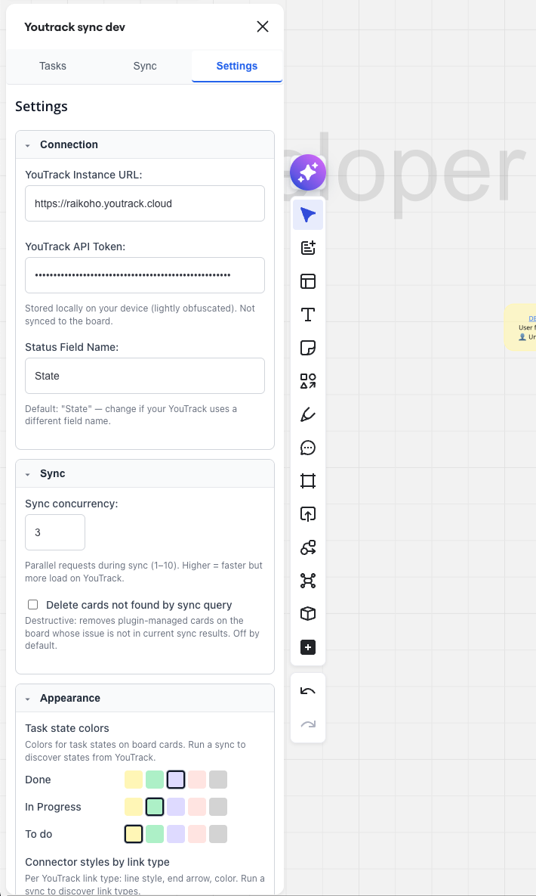
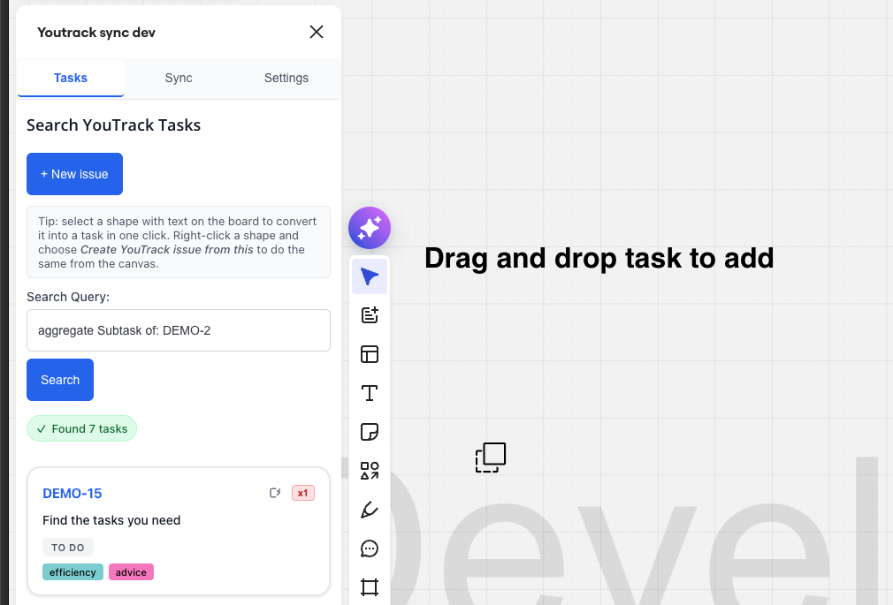
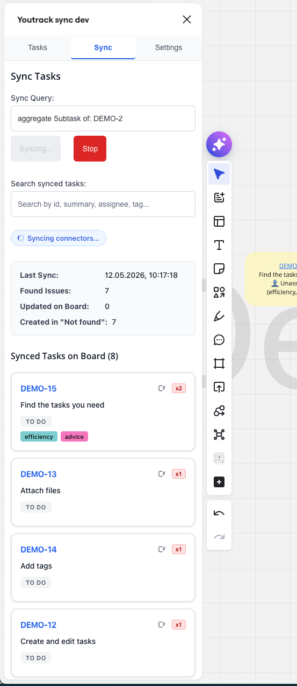
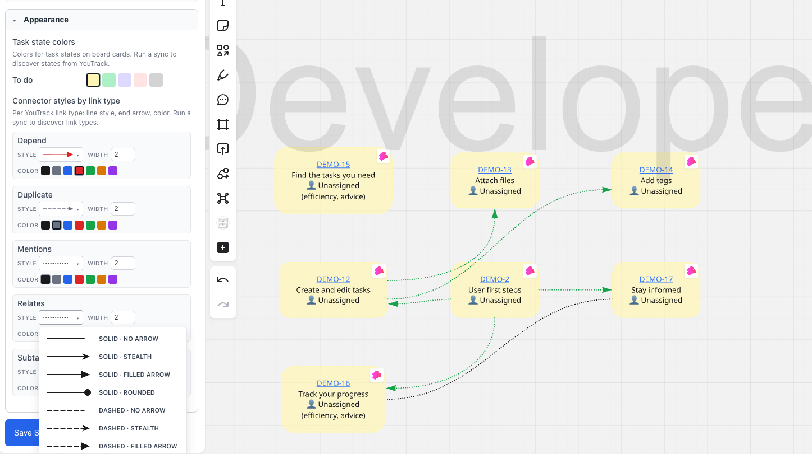
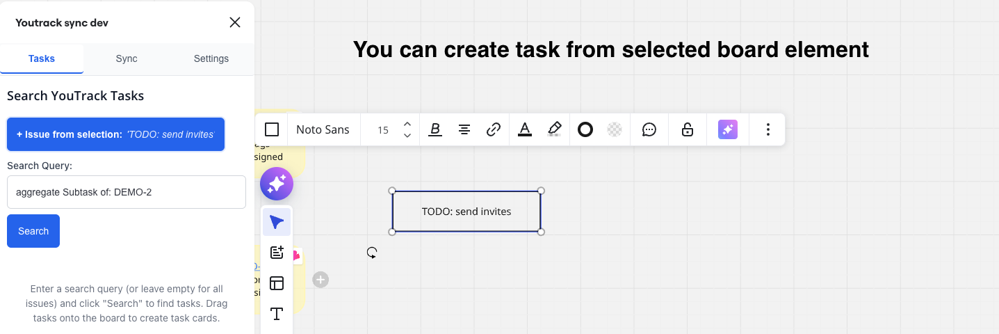

# YouTrack ↔ Miro plugin

Visualize YouTrack issues on a Miro board, sync state and links, create new
issues from board selection.

[usage_example.mp4](docs/screenshots/usage_example.mp4)

After rearranging, you can get visualization of your working flow to track it



## Install (users)

- **Miro marketplace**: search "YouTrack" in the Miro Apps panel and add it.

Then open any board and launch the plugin from the apps panel.

(plugin is hosted here, on github pages https://sensiarion.github.io/Miro-Youtrack-planning-plugin/)

## Setup

In the **Settings** tab fill in:

- YouTrack instance URL (e.g. `https://utrack.example.com`)
- Permanent token ([how to create a token](https://www.jetbrains.com/help/youtrack/cloud/manage-permanent-token.html))
- Status field name (default `State`)

URL + token are stored on your device (token lightly obfuscated). Per-board
settings (queries, colors, connector styles) live in Miro board storage.



## Search & drop tasks

**Tasks** tab → type
a [YouTrack query](https://www.jetbrains.com/help/youtrack/cloud/search-and-command-attributes.html) → drag any
issue onto the board. Card auto-styled by state color.



## Sync

**Sync** tab → enter a sync query → run. Plugin:

- Updates existing plugin-managed cards (state color, summary, assignee).
- Creates missing cards in a "Not found" frame.
- Builds connectors between linked cards (Subtask / Depend / Relates / Duplicate / Mentions).
- Optional: delete cards whose issue is no longer in query results.

Sync is cancellable mid-run.



## Connectors

Each YouTrack link type renders with a configurable style: line (solid /
dashed / dotted), end cap (none / stealth / filled arrow / rounded), color, width.

Built-in defaults:

- **Subtask** — solid blue with filled arrow (parent → child)
- **Depend** — solid red with stealth arrow (blocker → blocked)
- **Duplicate** — dashed purple with arrow
- **Relates** — dashed gray, no arrow (symmetric)
- **Mentions** — dotted slate, no arrow (parsed from descriptions/comments)

Arrow direction follows YouTrack link source → target regardless of which
end is iterated, so siblings render consistently.



Customize per link type in **Settings → Appearance**. Changes persist on the
board immediately, survive future syncs.

## Create issue from board

Select an existing plugin-managed card → right-click → **"Create YouTrack
subtask"**. Or use **"+ Create issue"** in Tasks tab.

Inline panel with project + summary + description + assignee + parent +
linked-issues fields. On save the issue is created in YouTrack and a new
card placed on the board.



## Develop

```bash
npm install
npm start          # http://localhost:3000
npm run build      # dist/
```

Point a Miro dev app at `http://localhost:3000` (see
[Miro docs](https://developers.miro.com/docs/build-your-first-hello-world-app)).

## License

MIT
